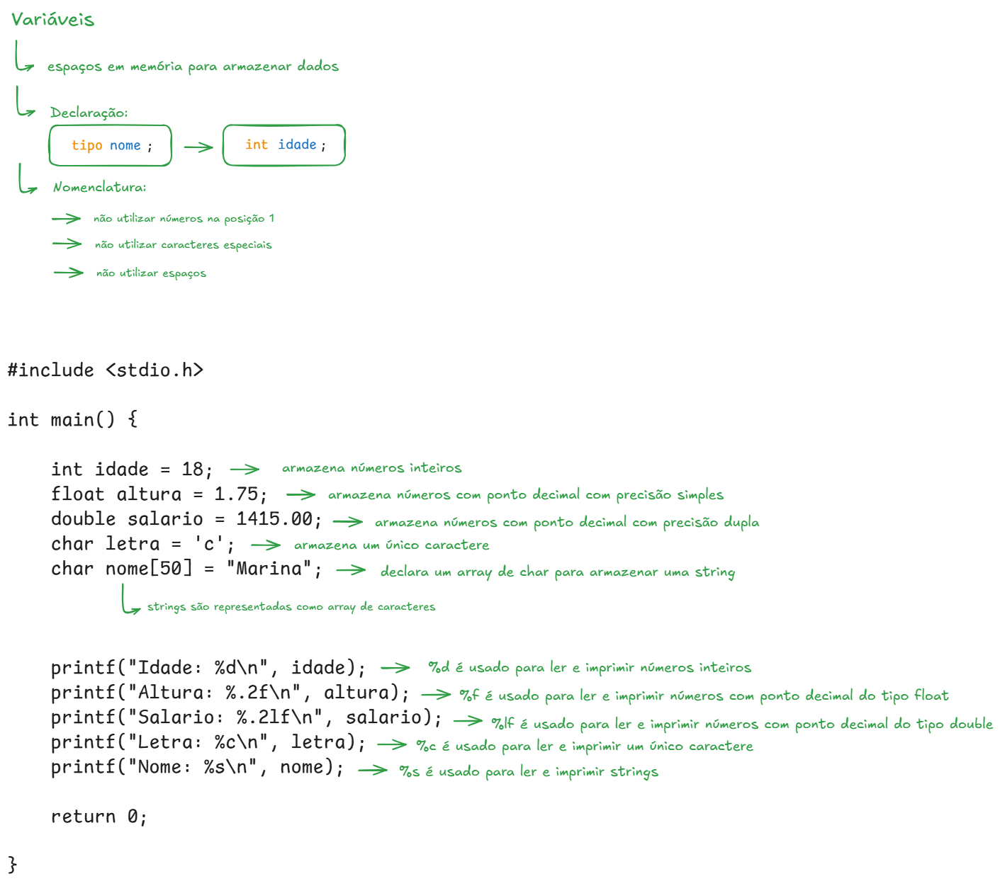
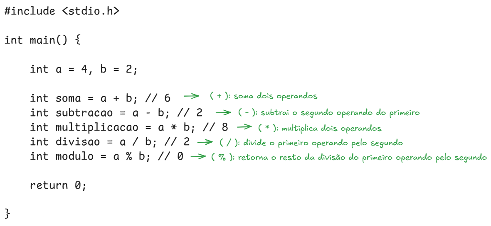
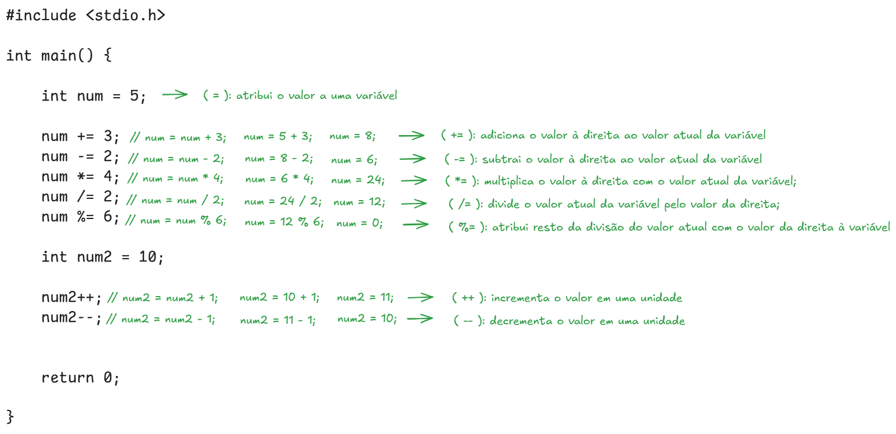
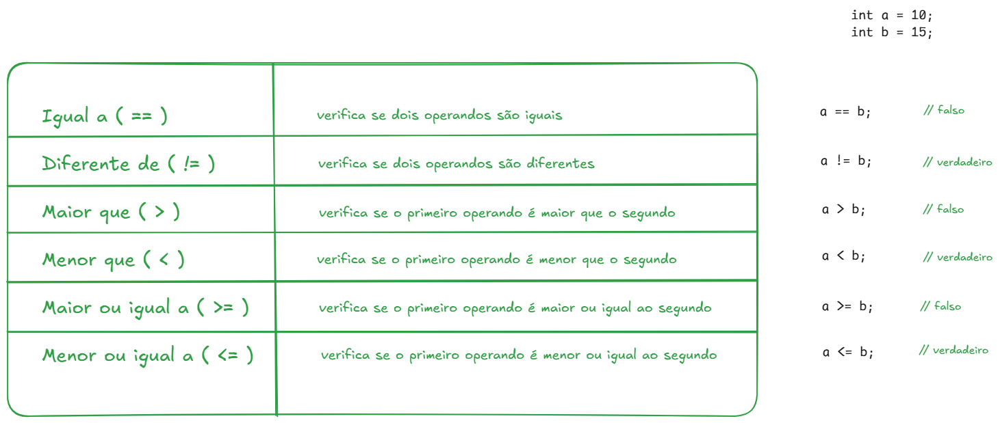
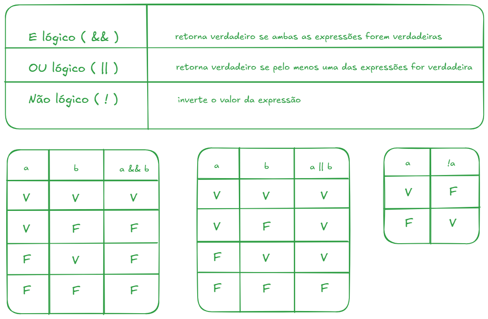
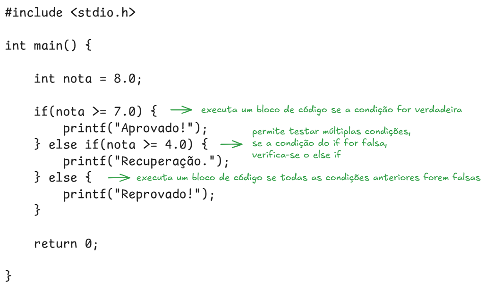
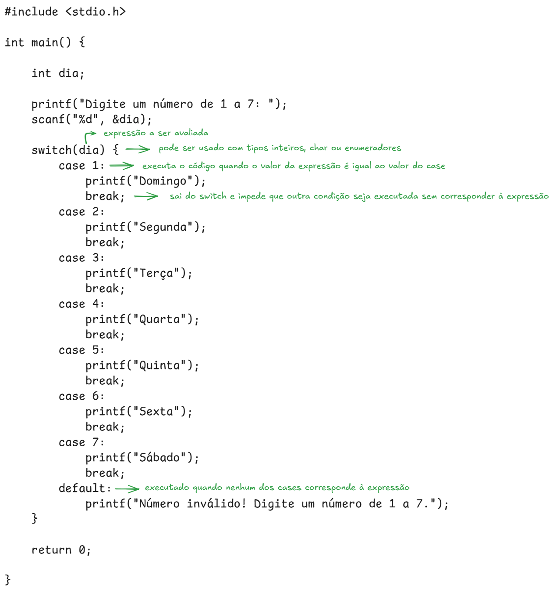
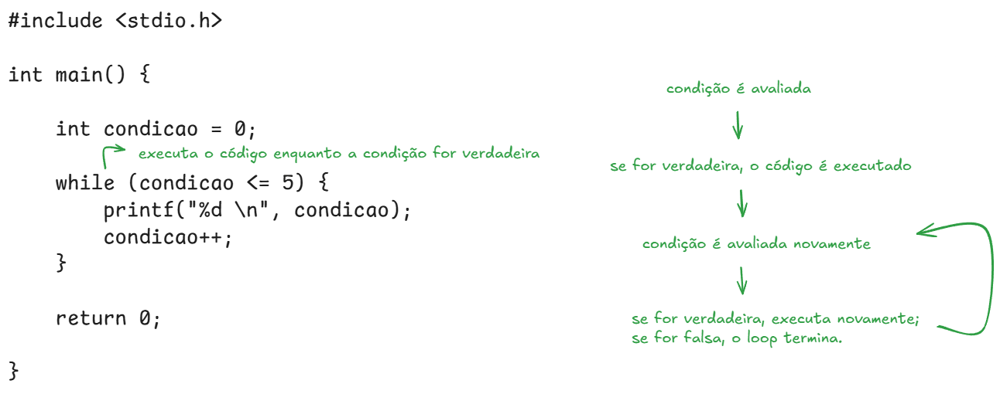
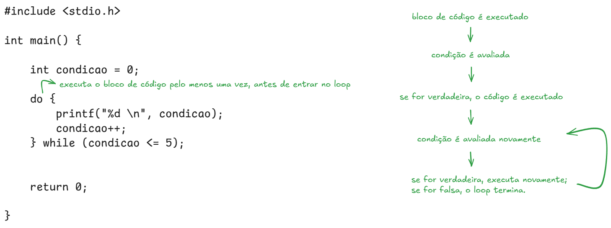
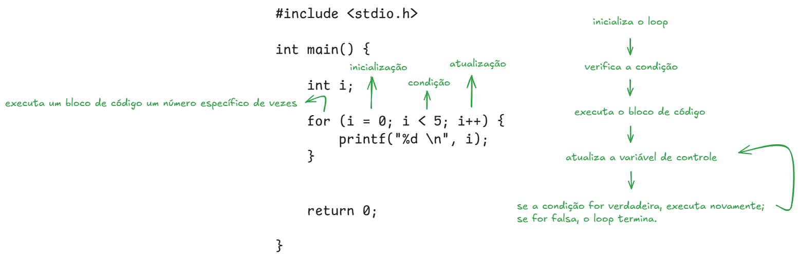

# Linguagem C

[Estrutura Básica](#estrutura-básica) | [Variáveis e Especificadores](#variáveis-e-especificadores) | [Operadores Aritméticos](#operadores-aritméticos) | [Operadores de Atribuição](#operadores-de-atribuição) | [Lista de Exercícios 001](#lista-de-exercícios-001) | [Operadores de Comparação](#operadores-de-comparação) | [Operadores Lógicos](#operadores-lógicos) | [Estruturas Condicionais: if - else if - else](#estruturas-condicionais-if---else-if---else) | [Estruturas Condicionais: switch - case](#estruturas-condicionais-switch---case) | [Lista de Exercícios 002](#lista-de-exercícios-002) | [Loops: while](#loops-while) | [Loops: do - while](#loops-do---while) | [Loops: for](#loops-for)

## Estrutura Básica

## Variáveis e Especificadores

## Operadores Aritméticos

## Operadores de Atribuição

## Lista de Exercícios 001
[Estrutura Sequencial em C](https://github.com/christianodavid/estrutura-sequencial-c)

## Operadores de Comparação

## Operadores Lógicos

## Estruturas Condicionais: if - else if - else

## Estruturas Condicionais: switch - case

## Lista de Exercícios 002
[Estruturas de Decisão em C](https://github.com/christianodavid/estruturas-decisao-c)

## Loops: while

## Loops: do - while

## Loops: for
